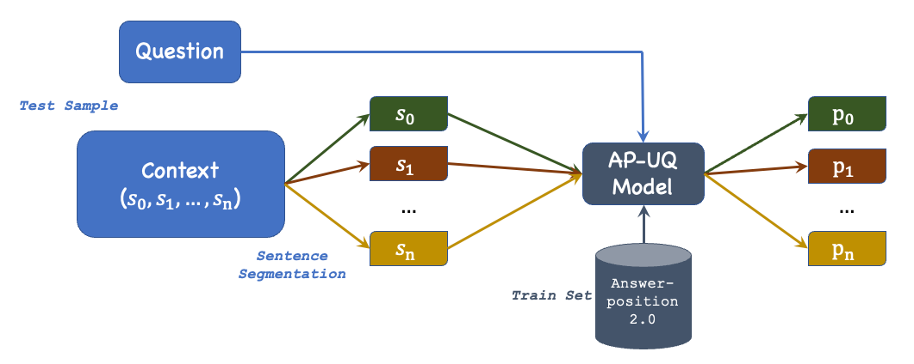

# Towards Mitigating Answer-Position Bias in Machine Reading Comprehension
## Introduction
> Machine Reading Comprehension (MRC) models have a tendency to take advantage of spurious correlations (also known as dataset bias or annotation artifacts in the research community). Consequently, these models may perform the MRC task without fully comprehending the given context and question, which is undesirable since it may result in low robustness against distribution shift. This paper delves into the concept of answer-position bias, where a significant percentage of training questions have answers located solely in the first sentence of the context. We hypothesize that the main reason causing the answer-position bias is that when model are trained with biased train set, which leads us to another hypothesis such that the MRC models can overcome the bias and achieve a good performance on the test set with anti-biased samples. We validate our hypothesis using model BERT and dataset SQuAD. We find the a large proportion of samples of development set SQuAD can be solved simply with answer-position bias, and this dataset is overestimate the true comprehension ability of MRC models. Besides, we also show that BERT trained with unanswerable questions can recognize that the first sentence in the context is not an appropriate source for the answer the question, but it fail to find out answer in other sentences of the context.

## Usage
### Dataset
Dataset used in this paper is SQuAD 1.1. Please download the dataset from the [official website](https://rajpurkar.github.io/SQuAD-explorer/). If you intend to use this repository with a different dataset, please convert the dataset into the json format used by SQuAD.
### Requirements
```
pip install src/requirements.txt
```
### Survey
In order to survey the answer-position bias in a dataset, run the following command in terminal
```
python src/position_bias.py [path_to_dataset] [analysis_save_path]
```
### Debias Answer-Position using Unanswerable Questions
Firstly, we need to train the model
```
python src/run_qa.py \
    --model_name_or_path [MODEL_NAME]\
    --train_file [path_to_train_file] \
    --validation_file [path_to_validation_file] \
    --do_train \
    --do_eval \
    --per_device_train_batch_size 8 \
    --per_device_eval_batch_size 8 \
    --learning_rate 2e-5 \
    --num_train_epochs 2 \
    --max_seq_length 384 \
    --max_answer_length 128 \
    --doc_stride 128 \
    --overwrite_output_dir \
    --version_2_with_negative \
    --output_dir  [model_save_path]
```
Note: [MODEL_NAME] is from the name on model card from [huggingface hub](https://huggingface.co/models). Models used in the paper are:


1.   BERT: bert-base-cased
2.   RoBERTa: roberta-base
3.   SpanBERT: SpanBERT/spanbert-base-cased

